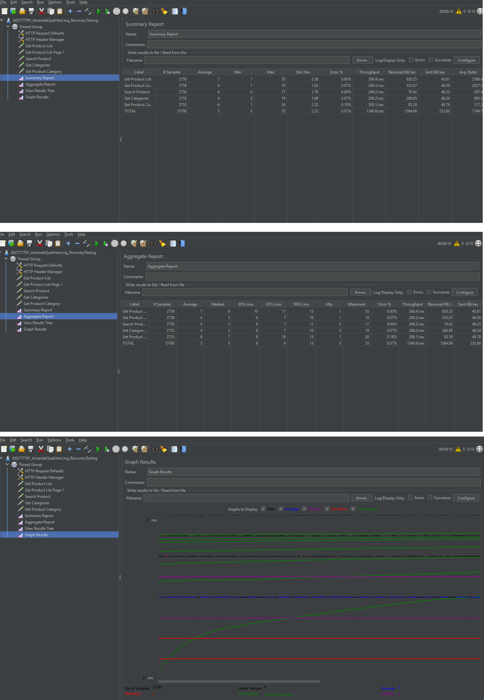
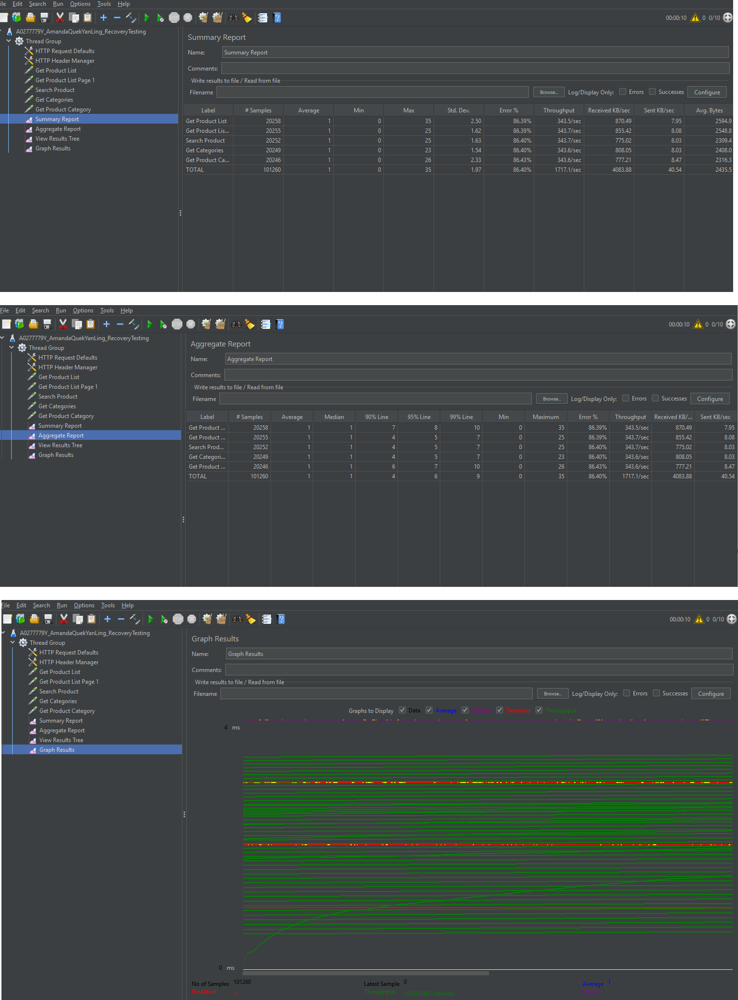
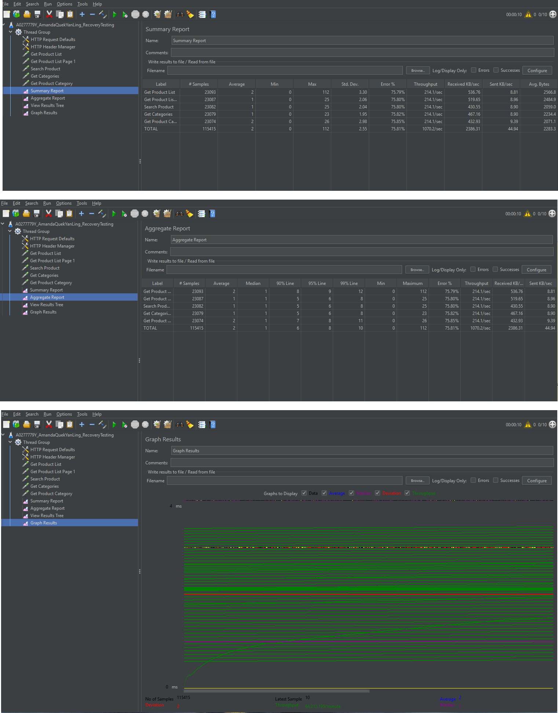
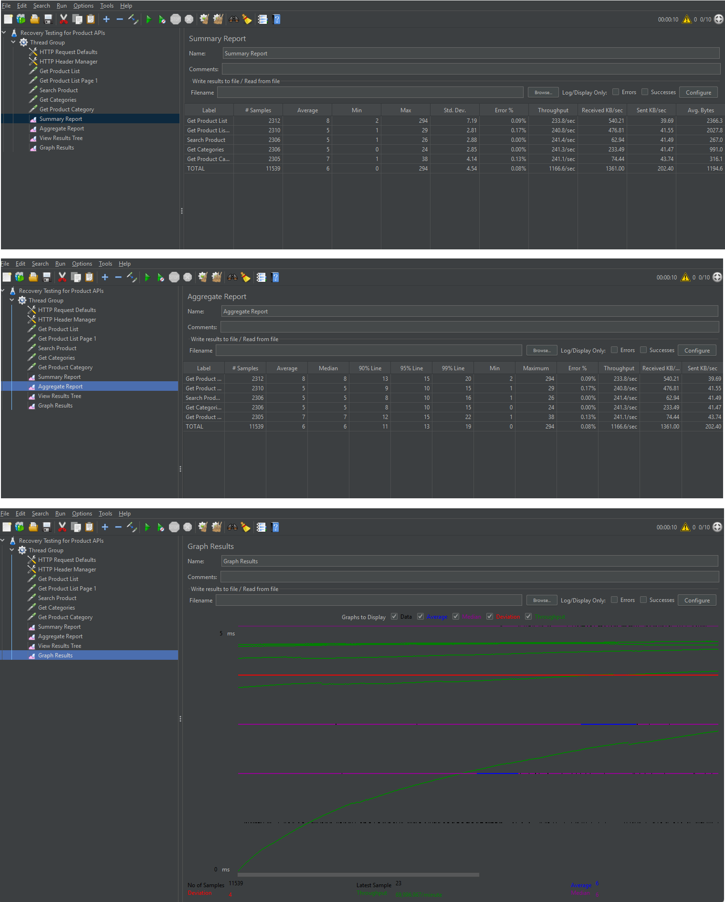
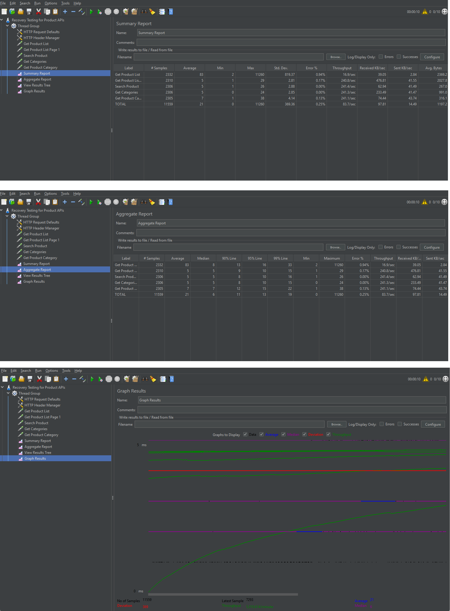
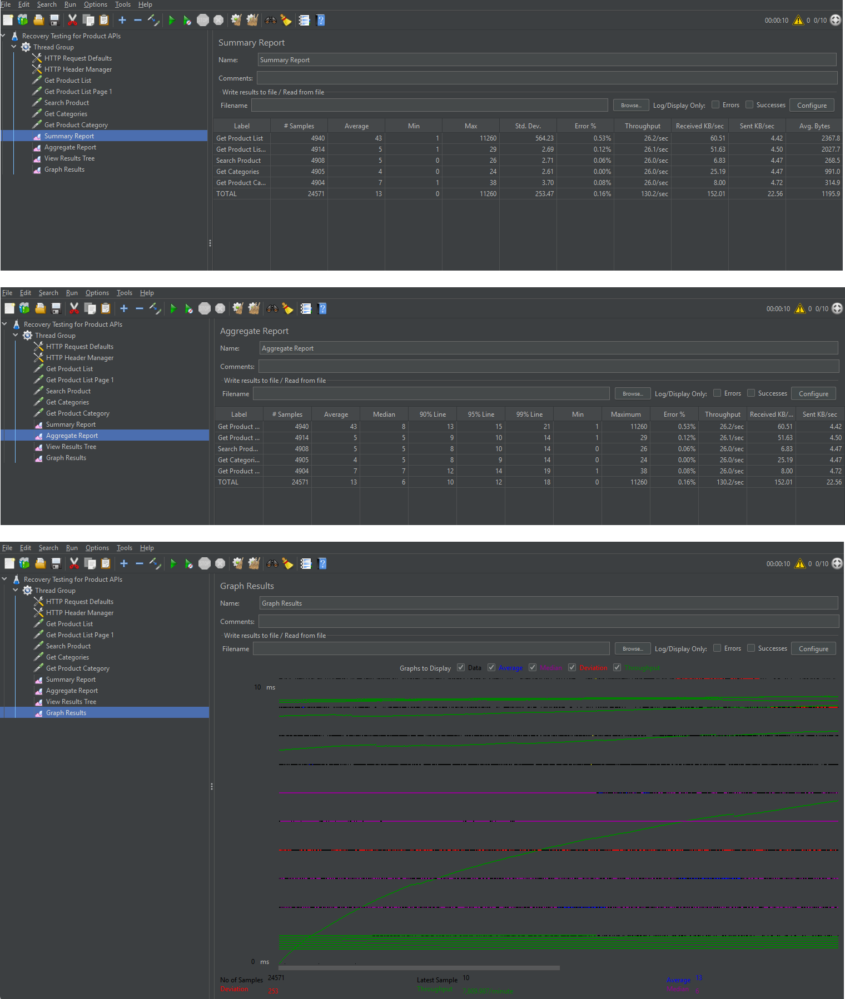
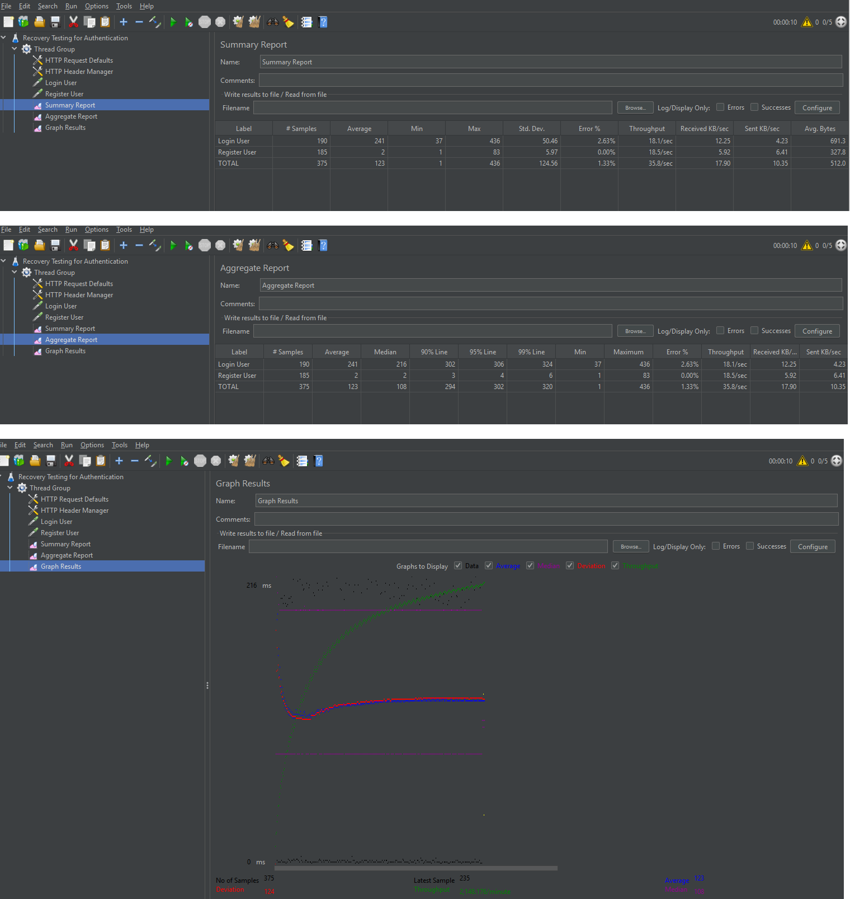
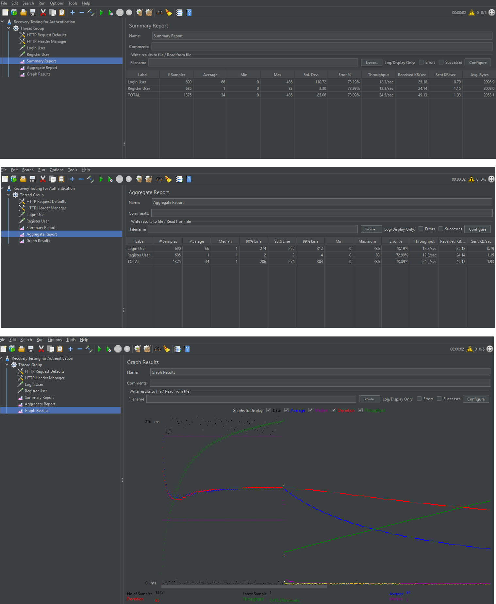
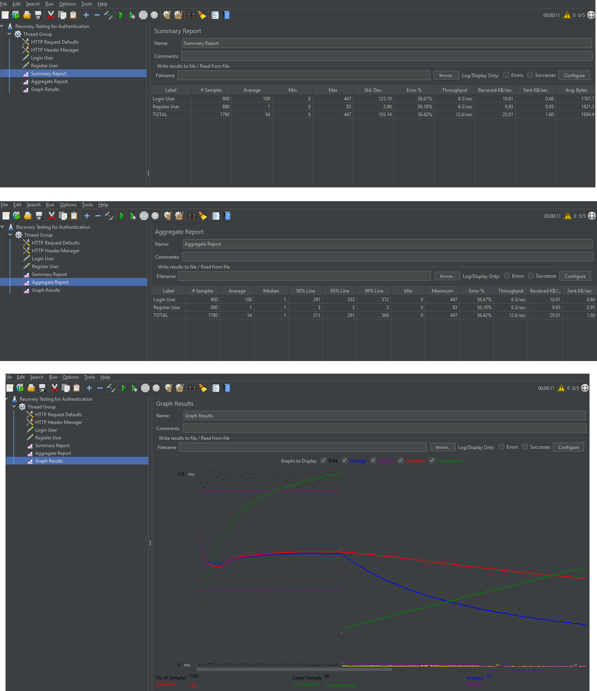

// Amanda Quek Yan Ling, A0277779Y

# Recovery Testing — JMeter Tests

This folder contains **Recovery Testing conducted using Apache JMeter**.
The tests simulate backend and database failures to evaluate how the system behaves under disruption and how well it recovers.

---
# Folder Structure
```
recovery-testing/
│
├── product-api/
│   ├── baseline.png
│   ├── failure.png
│   ├── recovery.png
│   ├── extended recovery.png
│
├── database/
│   ├── baseline.png
│   ├── failure.png
│   ├── recovery.png
│
├── authentication/
│   ├── baseline.png
│   ├── failure.png
│   ├── recovery.png
│
├── Recovery Testing for Product APIs and database.jmx
├── Recovery Testing for Authentication.jmx
└── README.md
```

---
# How To Run Recovery Tests
## Step 1 — Start Backend
Ensure backend server is running:

```bash
npm run dev
```
Backend runs on:
```
http://localhost:6060
```

---
## Step 2 — Start MongoDB
Ensure MongoDB is running before starting tests.
---

## Step 3 — Open JMeter
Open Apache JMeter and load one of the test files:
```
Recovery Testing for Product APIs and database.jmx
Recovery Testing for Authentication.jmx
```
---

## Step 4 — Run Test
Click **Start** in JMeter and allow requests to run continuously.

---

## Step 5 — Simulate Failure
During the test:

### Backend Failure
Stop backend:
```
CTRL + C
```
Wait 10 seconds.
Restart backend:
```
npm run dev
```
---

### Database Failure
Stop MongoDB service.
```
net stop MongoDB
```
Wait 10 seconds.
Restart MongoDB.
```
net start MongoDB
```

---

# Product API Recovery Testing
## Baseline


This screenshot shows the system operating normally.
Response time is low, throughput is stable, and error rate is minimal.
This establishes the baseline performance of the system.
---

## Failure Phase


During backend shutdown:
* Response time increases
* Throughput decreases
* Error rate increases

This indicates the system is unable to serve requests when backend services become unavailable.

---

## Recovery Phase


After backend restart:

* Response time stabilizes
* Throughput increases
* Error rate decreases

This demonstrates successful system recovery.
---

# Database Recovery Testing

## Database Running Normally


The system shows:
* Stable throughput
* Low response time
* Minimal errors

This confirms normal database operation.

---

## Database Failure


When MongoDB is stopped:
* Requests slow down
* Throughput drops
* Error rate increases
This indicates backend dependency on database services.

---

## Database Recovery


After MongoDB restart:
* Response time improves
* Throughput stabilizes
* System resumes normal behaviour
This confirms successful database recovery.

---

# Authentication Recovery Testing

## Baseline

Authentication requests operate normally:

* Login requests processed
* Register requests processed
* Stable performance observed
---

## Failure Phase



Backend shutdown causes:
* Login failures
* Registration failures
* Increased response time
This indicates authentication services depend on backend availability.

---

## Recovery Phase


After backend restart:
* Login resumes
* Registration resumes
* Performance stabilizes
Authentication services successfully recover.

---


The recovery tests demonstrate:
### System Resilience
The system does not crash permanently when failures occur.

---
### Graceful Degradation

During failure:
* Performance degrades
* Requests fail appropriately
The system handles failure predictably.

---

### Automatic Recovery
Once services restart:
* Requests resume
* Performance stabilizes
* No manual intervention required
---

### Reliability
The backend, database, and authentication services all successfully recover, demonstrating system reliability.

---
# Conclusion
Recovery testing confirms that the system:
* Handles backend failures
* Handles database failures
* Recovers authentication services
* Maintains stability after recovery
These results indicate that the system satisfies non-functional recovery testing requirements and demonstrates strong reliability under failure conditions.
